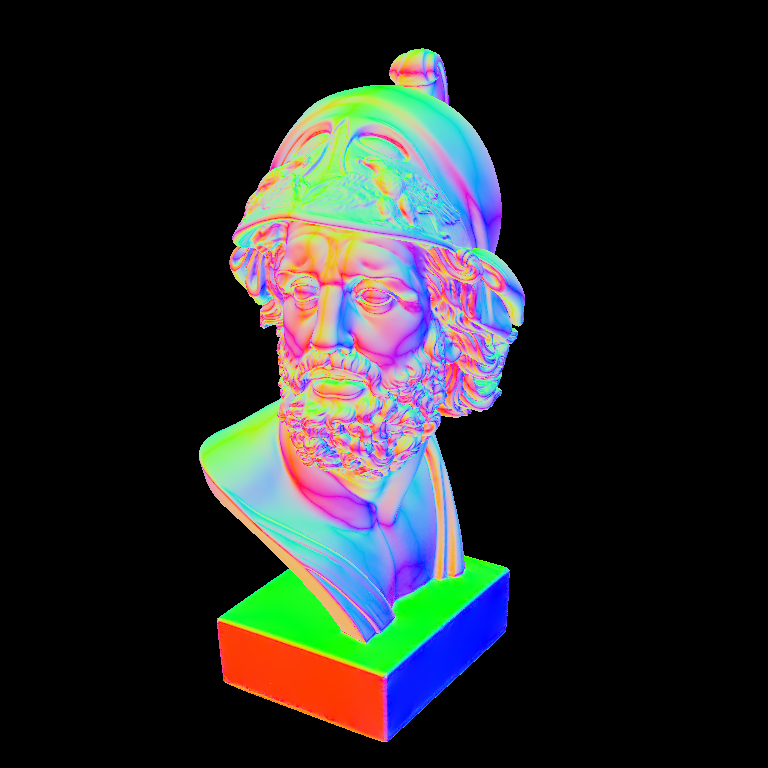
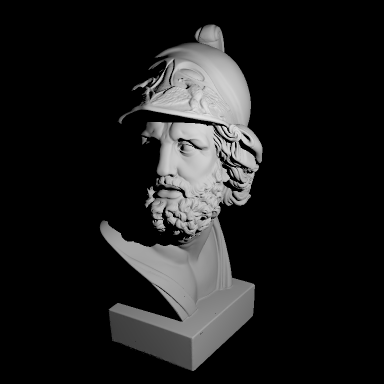
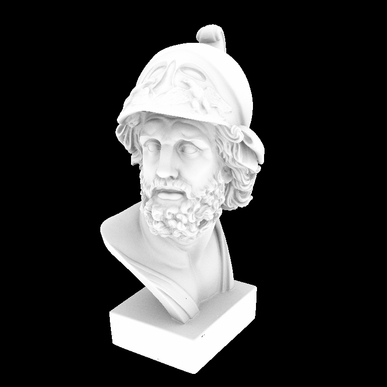

<h1 align="center">Just Renderer</h1>

# 简介

`Just Renderer` 基于以前制作的两个玩具：软光追渲染器 `Just Tracer` 和软光栅渲染器 `Just Rasterizer`，迭代为整合离线渲染和实时渲染的软渲染器。

本项目诞生于学习 `nori` 和 `pbrt` 的过程中，由于图形学的知识体系有了新的认识和纠正，于是借鉴了两款渲染器的框架和代码实现。但最终目的是个人用于复现学术论文的趁手工具以及学习图形学的工程实践。

# 展示

<table>
<tr>
<td>

<b> Ajax By Normals Integrator </b>

</td>
<td>

<b> Ajax By Simple Integrator </b>

</td>
<td>

<b> By AO Integrator </b>

</td>
</tr>
</table>

# 功能

## 纹理相关 `Common`

- [ ] 邻近过滤
- [ ] 双线性插值
- [ ] 三线性插值
- [ ] Mipmap
- [ ] Image Block
- [ ] Filter

## 相机相关 `Common`

- [x] 透视投影相机
- [ ] 正交投影相机

## 几何相关 `Common`

- [x] 轴对齐包围盒
- [ ] 非轴对齐包围盒
- [ ] 任意边界块

## 加速结构 `RayTracing`

- [x] BVH
- [x] Oct-Tree
- [ ] Kd-Tree

## 采样器 `RayTracing`

- [x] Independent Sampler
- [x] Random Sampler
- [x] Trapezoidal Sampler

## 积分器 `RayTracing`

- [x] Normal Integrator
- [x] Simple Integrator
- [x] AO Integrator
- [x] Whitted Integrator

## BxDF `RayTracing`

## 抗锯齿 `Rasterizer`

- [ ] SSAA
- [ ] MSAA

